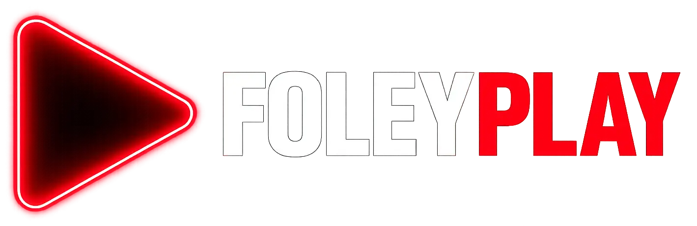

<div align="center">

<br />



<br />
<br />

### Next-Gen Editorial Entertainment & Cinema Streaming Experience

[](https://nextjs.org/)
[](https://react.dev/)
[](https://www.typescriptlang.org/)
[](https://tailwindcss.com/)
[](https://developer.themoviedb.org/)
[](LICENSE)

<br />

**FoleyPlay** es una plataforma web de descubrimiento y reproducción de cine, series y televisión en vivo desarrollada con un enfoque editorial moderno. Combina una interfaz oscura cinemática (`#080A09`), acentos funcionales en verde lima (`#CEFF00`), acceso abierto sin barreras (Zero-Auth), persistencia reactiva en el cliente y arquitectura multi-servidor con soporte de audio latino nativo.

[Explorar Demo](#-primeros-pasos) • [Características](#-características-principales) • [Arquitectura](#-arquitectura-técnica) • [Proveedores](#-proveedores-de-streaming)

---

</div>

## 🌟 Aspectos Destacados de la Versión 2.0

- 🎬 **Diseño Editorial Cinemático**: Hero rotativo de alta resolución, módulo Top 10 numerado a gran escala y colecciones destacadas (Spotlights).
- ⚡ **Acceso Abierto (Zero-Auth)**: Sin formularios de inicio de sesión ni barreras de registro; acceso directo a todo el catálogo desde el primer clic.
- 🎯 **Descubrimiento Activo en Tiempo Real**: Barra interactiva de géneros (`DiscoverySection`) que filtra instantáneamente películas y series con paginación dinámica.
- 🔍 **Buscador en Vivo Inteligente**: Componente `HeaderSearch` con debouncing reactivo, vista previa de carátulas y navegación fluida.
- 📺 **TV en Vivo (IPTV + EPG)**: Reproductor HLS integrado con guía de programación electrónica y categorización de señales.
- 📡 **Streaming Multi-Servidor**: Servidor predeterminado con multi-audio y nueva alternativa HLS directa en **Español Latino**.
- 💾 **Biblioteca Personal Reactiva**: _Mi Lista_, _Continuar Viendo_ y _Calificaciones_ sincronizadas automáticamente en `localStorage` con eventos entre pestañas.

---

## 🏗 Arquitectura Técnica

```text
┌─────────────────────────────────────────────────────────────┐
│                   Next.js 16 (App Router)                   │
│                                                             │
│  ┌─────────────────────────────────┐  ┌──────────────────┐  │
│  │         Vistas Públicas         │  │   Route Handlers │  │
│  │  /browse   /movies    /tv       │  │  /api/tmdb/...   │  │
│  │  /movie/[id]  /tv/[id]  /search │  │  /api/providers/ │  │
│  │  /watchlist   /history          │  │  /api/subtitles  │  │
│  │  /tv-en-vivo  /legal/*          │  │  /api/iptv/epg   │  │
│  └─────────────────────────────────┘  └──────────────────┘  │
└─────────────────────────────────────────────────────────────┘
         │                                    │
         ▼                                    ▼
    localStorage (Browser)               TMDB & APIs Externas
    ├── Mi Lista (Watchlist)             ├── Metadatos e Imágenes
    ├── Historial (Playback)             ├── Subtítulos OpenSubtitles
    └── Calificaciones (Like/Dislike)    └── Streams HLS / Embeds
```

---

## 🛠 Stack Tecnológico

| Capa                | Herramienta                | Propósito                                              |
| ------------------- | -------------------------- | ------------------------------------------------------ |
| **Core Framework**  | Next.js 16.2.4 (Turbopack) | Server Components, Route Handlers y Optimización       |
| **Biblioteca UI**   | React 19.2.4               | Renderizado declarativo y concurrente                  |
| **Lenguaje**        | TypeScript 5               | Tipado estático estricto de extremo a extremo          |
| **Estilos**         | Tailwind CSS v4            | Sistema de tokens editoriales y diseño responsivo      |
| **Animaciones**     | Framer Motion 12           | Transiciones de página, modales y micro-interacciones  |
| **Streaming HLS**   | Hls.js 1.6                 | Reproductor HLS nativo para canales y streams directos |
| **Iconografía**     | Lucide React               | Iconos vectoriales minimalistas y optimizados          |
| **Metadatos & SEO** | Schema.org + JSON-LD       | Indexación semántica de películas y series             |

---

## 🚀 Primeros Pasos

### Requisitos Previos

- **Node.js**: `>= 20.x`
- **NPM**, **PNPM** o **Yarn**
- Cuenta gratuita en [The Movie Database (TMDB)](https://www.themoviedb.org/) para obtener una API Key.

### Instalación

1. **Clonar el repositorio:**

   ```bash
   git clone https://github.com/cristborrero/foleyplay.git
   cd foleyplay
   ```

2. **Instalar dependencias:**

   ```bash
   npm install
   ```

3. **Configurar variables de entorno:**
   Copia el archivo de ejemplo y agrega tu clave de TMDB:

   ```bash
   cp .env.local.example .env.local
   ```

   Edita `.env.local`:

   ```env
   # TMDB API
   TMDB_API_KEY=tu_tmdb_api_key_aqui
   TMDB_BASE_URL=https://api.themoviedb.org/3
   TMDB_IMAGE_BASE_URL=https://image.tmdb.org/t/p

   # Subtítulos (Opcional)
   OPENSUBTITLES_API_KEY=
   OPENSUBTITLES_USER_AGENT=FoleyPlayApp v1.0

   # Configuración de Aplicación
   NEXT_PUBLIC_APP_NAME="FoleyPlay"
   NEXT_PUBLIC_APP_URL=http://localhost:3000
   ```

4. **Ejecutar el servidor de desarrollo:**

   ```bash
   npm run dev
   ```

5. Abre [http://localhost:3000](http://localhost:3000) en tu navegador para ver la aplicación.

---

## 🎥 Proveedores de Streaming

FoleyPlay incluye un selector de fuentes para garantizar la disponibilidad continua del contenido:

| #     | Servidor           | Formato               | Doblaje / Idioma      | Características                                    |
| ----- | ------------------ | --------------------- | --------------------- | -------------------------------------------------- |
| **1** | **UnlimPlay**      | Direct Embed          | Multi-audio (ES / EN) | Servidor predeterminado, cobertura total TMDB      |
| **2** | **Latino Directo** | HLS Directo (`.m3u8`) | Español Latino        | Reproductor HTML5 limpio vía ZonaAPI, sin anuncios |
| **3** | **VidLink**        | Direct Embed          | Multi-audio (ES / EN) | Alternativa rápida con selector de idioma          |
| **4** | **VidSrc.to**      | Direct Embed          | Audio Original / Sub  | Servidor alternativo directo                       |
| **5** | **MultiEmbed**     | Direct Embed          | Audio Original / Sub  | Respaldo adicional                                 |
| **6** | **VidSrc.su**      | Direct Embed          | Audio Original / Sub  | Respaldo con soporte IMDb                          |

---

## 📂 Estructura del Proyecto

```text
├── app/
│   ├── (main)/              # Rutas públicas (browse, movies, tv, search, etc.)
│   ├── api/                 # Endpoints internos (tmdb, providers, subtitles, epg)
│   ├── globals.css          # Tokens de diseño v2.0 y directivas Tailwind
│   └── layout.tsx           # Root layout con metadata base y providers
├── components/
│   ├── cards/               # MovieCard con hover responsivo y badges
│   ├── catalog/             # GenreCatalog con filtrado por categoría
│   ├── detail/              # Modal y vistas de detalle (Cast, Trailers, Acciones)
│   ├── home/                # HeroBanner, DiscoverySection, TopTenRow, Spotlight
│   ├── layout/              # Navbar editorial, HeaderSearch, Footer
│   └── player/              # ServerSelector, LivePlayer, PlayerModal
├── hooks/                   # useWatchlist, useHistory, useRatings
├── lib/                     # Clientes TMDB, mapeo de streams, utilidades
└── public/                  # Assets estáticos, logos, manifest PWA
```

---

## ⚖️ Aviso Legal y Atribución

Este proyecto ha sido desarrollado exclusivamente con **fines educativos y demostrativos** de arquitectura de software full-stack.

- **Metadatos e Imágenes**: Proporcionados por [The Movie Database (TMDB)](https://www.themoviedb.org/). Este producto utiliza la API de TMDB pero no está respaldado ni certificado por TMDB.
- **Transmisiones de Video**: FoleyPlay no aloja, almacena ni transmite ningún archivo de video en sus propios servidores; la plataforma actúa únicamente como interfaz para APIs y reproductores públicos de terceros.

---

<div align="center">

Desarrollado con ❤️ para la comunidad de código abierto.

</div>
